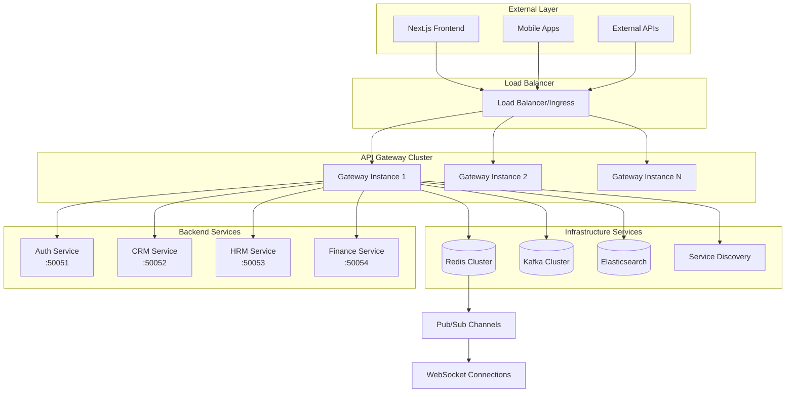
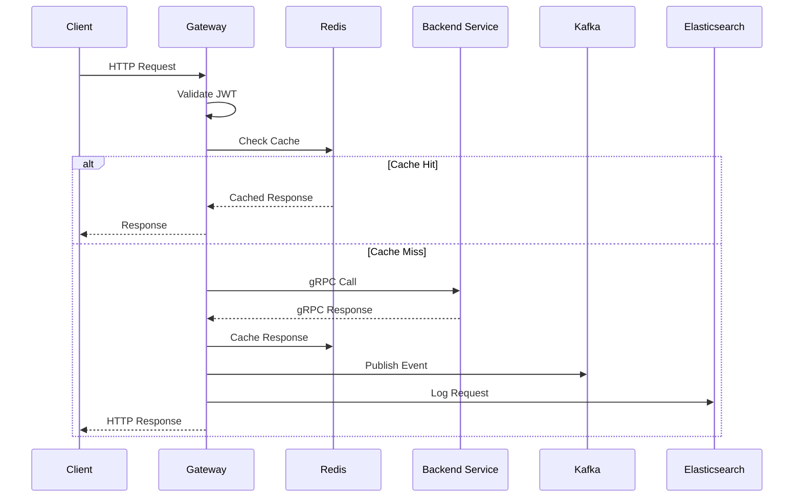

# ERP API Gateway - Technical Documentation

## Table of Contents
1. [Overview](#overview)
2. [Architecture](#architecture)
3. [System Components](#system-components)
4. [API Endpoints](#api-endpoints)
5. [Authentication & Authorization](#authentication--authorization)
6. [Real-time Features](#real-time-features)
7. [Data Flow](#data-flow)
8. [Configuration](#configuration)
9. [Testing](#testing)
10. [Deployment](#deployment)
11. [Monitoring & Observability](#monitoring--observability)
12. [Performance](#performance)
13. [Security](#security)
14. [Troubleshooting](#troubleshooting)

## Overview

The ERP API Gateway is a high-performance, enterprise-grade Go-based gateway service that serves as the central entry point for the ERP system. It replaces the existing Django DRF API Gateway while maintaining full backward compatibility with the Next.js frontend.

### Key Features
- **Multi-Protocol Support**: REST, GraphQL, and WebSocket endpoints
- **High Performance**: Built with Go and Gin framework for optimal performance
- **Microservices Integration**: gRPC communication with backend services
- **Real-time Messaging**: WebSocket support with Redis Pub/Sub coordination
- **Comprehensive Security**: JWT validation, RBAC, and security best practices
- **Horizontal Scalability**: Stateless design with Redis-based coordination
- **Enterprise Observability**: Structured logging, metrics, and distributed tracing

### Technology Stack
- **Language**: Go 1.23+
- **Web Framework**: Gin
- **gRPC**: Protocol Buffers for service communication
- **GraphQL**: gqlgen for GraphQL server
- **WebSocket**: Gorilla WebSocket
- **Cache/Messaging**: Redis (caching, sessions, pub/sub)
- **Event Streaming**: Apache Kafka
- **Logging**: Elasticsearch with structured JSON
- **Testing**: Testify with comprehensive mocks
- **Containerization**: Docker with Alpine Linux
- **Orchestration**: Kubernetes

## Architecture

### High-Level Architecture



### Request Flow Architecture



## System Components

### 1. HTTP Server (`cmd/server/main.go`)

The main server component that initializes and orchestrates all services.

```go
type Server struct {
    router        *gin.Engine
    config        *config.Config
    grpcClient    *service.GRPCClient
    redisClient   *service.RedisClient
    kafkaProducer *service.KafkaProducer
    logger        *logging.ElasticLogger
    wsHandler     *websocket.Handler
}
```

**Key Responsibilities:**
- Initialize dependency injection container
- Configure middleware chain
- Register API routes
- Manage graceful shutdown
- Health check endpoints

### 2. Middleware Layer

#### Authentication Middleware (`middleware/auth.go`)
Handles JWT token validation and user claim extraction.

```go
type AuthMiddleware struct {
    jwtValidator *JWTValidator
    redisClient  *service.RedisClient
    logger       *logging.Logger
}
```

**Features:**
- RS256 JWT signature verification
- JWKS (JSON Web Key Set) support for key rotation
- Token caching in Redis for performance
- User claims extraction (user_id, roles, permissions)
- Optional authentication for public endpoints

#### RBAC Middleware (`middleware/rbac.go`)
Enforces role-based access control policies.

```go
type RBACMiddleware struct {
    policyEngine *PolicyEngine
    redisClient  *service.RedisClient
    logger       *logging.Logger
}
```

**Features:**
- Permission-based access control
- Role hierarchy support
- Permission caching for performance
- Flexible policy engine
- Audit logging for access decisions

#### Logging Middleware (`middleware/logger.go`)
Provides structured request/response logging.

```go
type LoggingMiddleware struct {
    logger *logging.ElasticLogger
}
```

**Features:**
- Structured JSON logging
- Request correlation IDs
- Performance metrics (duration, status codes)
- Async logging to prevent performance impact
- Error logging with stack traces

### 3. API Handlers

#### REST API Handlers (`api/rest/`)
Handle HTTP REST endpoints with backward compatibility.

```go
type AuthHandler struct {
    grpcClient    *service.GRPCClient
    redisClient   *service.RedisClient
    kafkaProducer *service.KafkaProducer
    logger        *logging.Logger
}
```

**Endpoints:**
- `POST /auth/login/` - User authentication
- `POST /auth/register/` - User registration
- `POST /auth/refresh/` - Token refresh
- `POST /auth/logout/` - User logout
- `GET /auth/me/` - Current user information

#### GraphQL Handler (`api/graphql/`)
Provides GraphQL endpoint with schema stitching.

```go
type GraphQLHandler struct {
    schema     graphql.Schema
    grpcClient *service.GRPCClient
    dataLoader *DataLoader
    logger     *logging.Logger
}
```

**Features:**
- Schema generation from gRPC services
- DataLoader pattern for N+1 query prevention
- GraphQL Playground for development
- Subscription support via WebSocket
- Query complexity analysis

#### WebSocket Handler (`api/ws/`)
Manages real-time WebSocket connections.

```go
type WebSocketHandler struct {
    upgrader    websocket.Upgrader
    redisClient *service.RedisClient
    connManager *ConnectionManager
    logger      *logging.Logger
}
```

**Features:**
- JWT-based WebSocket authentication
- Connection lifecycle management
- Redis Pub/Sub integration
- User-specific notification channels
- Graceful connection handling

### 4. Service Layer

#### gRPC Client Service (`internal/services/grpc_client/`)
Manages connections to backend microservices.

```go
type GRPCClient struct {
    connections map[string]*grpc.ClientConn
    config      *config.GRPCConfig
    logger      *logging.Logger
    metrics     *metrics.GRPCMetrics
}
```

**Features:**
- Connection pooling and reuse
- Circuit breaker pattern for fault tolerance
- Retry logic with exponential backoff
- Service discovery integration
- Load balancing across service instances

#### Redis Client Service (`internal/services/redis/`)
Provides caching, session management, and pub/sub functionality.

```go
type RedisClient struct {
    client  redis.UniversalClient
    pubsub  *redis.PubSub
    config  *config.RedisConfig
    logger  *logging.Logger
}
```

**Features:**
- Response caching with configurable TTL
- Session data storage
- Pub/Sub for real-time messaging
- Connection pooling and failover
- Cluster support

#### Kafka Producer Service (`internal/services/kafka/`)
Handles event publishing to Kafka topics.

```go
type KafkaProducer struct {
    producer sarama.AsyncProducer
    config   *config.KafkaConfig
    logger   *logging.Logger
}
```

**Features:**
- Async event publishing
- Retry logic with dead letter queues
- Event serialization and metadata
- Topic partitioning strategies
- Producer metrics and monitoring

## API Endpoints

### REST API Endpoints

#### Authentication Endpoints

| Method | Endpoint | Description | Auth Required |
|--------|----------|-------------|---------------|
| POST | `/auth/login/` | User login | No |
| POST | `/auth/register/` | User registration | No |
| POST | `/auth/refresh/` | Refresh access token | No |
| POST | `/auth/logout/` | User logout | Yes |
| GET | `/auth/me/` | Get current user | Yes |

#### Health Check Endpoints

| Method | Endpoint | Description | Auth Required |
|--------|----------|-------------|---------------|
| GET | `/health` | Basic health check | No |
| GET | `/ready` | Readiness check with dependencies | No |
| GET | `/metrics` | Prometheus metrics | No |

### GraphQL Endpoint

| Method | Endpoint | Description | Auth Required |
|--------|----------|-------------|---------------|
| POST | `/graphql` | GraphQL queries and mutations | Optional |
| GET | `/graphql` | GraphQL Playground (dev only) | No |

### WebSocket Endpoint

| Method | Endpoint | Description | Auth Required |
|--------|----------|-------------|---------------|
| GET | `/ws` | WebSocket connection upgrade | Yes |

### Request/Response Format

#### Standard Response Format
All API responses follow a consistent format for frontend compatibility:

```json
{
  "success": true,
  "data": {
    // Response data
  },
  "message": "Success message",
  "errors": {
    "field_name": ["Error message"]
  }
}
```

#### Error Response Format
```json
{
  "success": false,
  "message": "Error description",
  "errors": {
    "email": ["Email is required"],
    "password": ["Password must be at least 8 characters"]
  }
}
```

## Authentication & Authorization

### JWT Token Validation

The gateway uses RS256 JWT tokens with the following claims structure:

```json
{
  "user_id": "uuid",
  "email": "user@example.com",
  "roles": ["admin", "user"],
  "permissions": ["read:users", "write:users"],
  "exp": 1640995200,
  "iat": 1640908800,
  "iss": "auth-service",
  "sub": "user-uuid"
}
```

### RBAC Implementation

Role-Based Access Control is implemented through middleware that checks:

1. **User Roles**: Hierarchical role system (admin > manager > user)
2. **Permissions**: Granular permissions (read:resource, write:resource)
3. **Resource Access**: Context-aware permission checking
4. **Caching**: Permission lookups cached in Redis

### Security Features

- **Token Caching**: Valid tokens cached to reduce validation overhead
- **Key Rotation**: JWKS support for seamless key rotation
- **Rate Limiting**: Per-user and per-IP rate limiting
- **CORS Protection**: Configurable CORS policies
- **Input Validation**: Comprehensive input sanitization

## Real-time Features

### WebSocket Implementation

The gateway provides real-time capabilities through WebSocket connections:

1. **Connection Authentication**: JWT-based WebSocket authentication
2. **User Channels**: User-specific notification channels (`notifications:<user_id>`)
3. **Event Broadcasting**: System-wide event broadcasting
4. **Connection Management**: Graceful connection handling and cleanup

### Redis Pub/Sub Integration

Real-time messaging is coordinated through Redis Pub/Sub:

```go
// Channel patterns
notifications:<user_id>    // User-specific notifications
events:<event_type>        // Event-type specific channels
system:broadcast          // System-wide broadcasts
```

### Event Types

Common real-time events:
- User login/logout notifications
- System alerts and maintenance notices
- Business process updates
- Real-time data synchronization

## Data Flow

### Request Processing Flow

1. **Request Reception**: Gin router receives HTTP request
2. **Middleware Chain**: Request passes through middleware stack
   - Panic recovery
   - Request logging
   - CORS handling
   - Rate limiting
   - Authentication (if required)
   - Authorization (if required)
3. **Handler Processing**: Route handler processes request
4. **Cache Check**: Check Redis for cached response
5. **Service Call**: Make gRPC call to backend service (if cache miss)
6. **Response Caching**: Cache response in Redis (if cacheable)
7. **Event Publishing**: Publish business events to Kafka
8. **Response**: Return HTTP response to client

### Event Publishing Flow

1. **Business Event**: Handler identifies business event
2. **Event Creation**: Create structured event with metadata
3. **Kafka Publishing**: Async publish to Kafka topic
4. **Redis Pub/Sub**: Publish to Redis for real-time updates
5. **WebSocket Broadcasting**: Broadcast to connected WebSocket clients
6. **Error Handling**: Retry logic and dead letter queues

## Configuration

### Configuration Structure

The gateway uses YAML configuration with environment variable overrides:

```yaml
server:
  port: 8080
  host: "0.0.0.0"
  read_timeout: "30s"
  write_timeout: "30s"
  shutdown_timeout: "10s"
  cors:
    allowed_origins:
      - "http://localhost:3000"
    allowed_methods:
      - "GET"
      - "POST"
      - "PUT"
      - "DELETE"
    allow_credentials: true

grpc:
  services:
    auth:
      address: "auth-service:50051"
      timeout: "10s"
      max_retries: 3
    crm:
      address: "crm-service:50052"
      timeout: "10s"
      max_retries: 3

redis:
  address: "redis:6379"
  password: ""
  db: 0
  pool_size: 10
  max_retries: 3

kafka:
  brokers:
    - "kafka:9092"
  client_id: "api-gateway"
  max_retries: 3

jwt:
  public_key_path: "/etc/certs/jwt-public.pem"
  jwks_url: "https://auth-service/jwks"
  cache_ttl: "1h"
  algorithm: "RS256"

logging:
  level: "info"
  elasticsearch:
    addresses:
      - "http://elasticsearch:9200"
    index: "api-gateway-logs"
    batch_size: 100
    flush_interval: "5s"
```

### Environment Variables

Configuration can be overridden using environment variables:

```bash
# Server configuration
SERVER_PORT=8080
SERVER_HOST=0.0.0.0

# gRPC services
GRPC_AUTH_ADDRESS=auth-service:50051
GRPC_CRM_ADDRESS=crm-service:50052

# Redis configuration
REDIS_ADDRESS=redis:6379
REDIS_PASSWORD=secret

# Kafka configuration
KAFKA_BROKERS=kafka1:9092,kafka2:9092

# JWT configuration
JWT_PUBLIC_KEY_PATH=/etc/certs/jwt-public.pem
JWT_JWKS_URL=https://auth-service/jwks
```

## Testing

### Test Structure

The project follows a comprehensive testing strategy:

```
test/
├── unit/           # Unit tests for individual components
├── integration/    # Integration tests for complete flows
├── load/          # Load and performance tests
└── mocks/         # Mock implementations for testing
```

### Unit Testing

#### Test Coverage Requirements
- **Minimum 90% coverage** for all packages
- **100% coverage** for security-critical components
- **Comprehensive edge case testing**

#### Mock Strategy
Using `testify/mock` for all external dependencies:

```go
type MockGRPCClient struct {
    mock.Mock
}

func (m *MockGRPCClient) AuthService() authpb.AuthServiceClient {
    args := m.Called()
    return args.Get(0).(authpb.AuthServiceClient)
}
```

### Integration Testing

Integration tests verify complete request flows:

```go
func TestAuthenticationFlow(t *testing.T) {
    // Setup test server
    server := setupTestServer()
    defer server.Close()
    
    // Test login
    loginResp := testLogin(server, validCredentials)
    assert.True(t, loginResp.Success)
    
    // Test protected endpoint
    userResp := testGetCurrentUser(server, loginResp.Data.AccessToken)
    assert.True(t, userResp.Success)
    
    // Test logout
    logoutResp := testLogout(server, loginResp.Data.AccessToken)
    assert.True(t, logoutResp.Success)
}
```

### Load Testing

Performance tests verify scalability requirements:

```go
func TestLoadPerformance(t *testing.T) {
    // Test concurrent connections
    concurrency := 1000
    requests := 10000
    
    results := loadTest(concurrency, requests)
    
    assert.Less(t, results.ErrorRate, 0.01) // <1% error rate
    assert.Less(t, results.AvgResponseTime, 100*time.Millisecond)
}
```

### Test Commands

```bash
# Run all tests with coverage
go test -v -cover ./...

# Run unit tests only
go test -v -cover ./api/... ./internal/... ./middleware/...

# Run integration tests
go test -v ./test/integration/...

# Run load tests
go test -v ./test/load/...

# Generate coverage report
go test -coverprofile=coverage.out ./...
go tool cover -html=coverage.out -o coverage.html

# Run tests with race detection
go test -race ./...

# Benchmark tests
go test -bench=. ./...
```

## Deployment

### Docker Configuration

#### Multi-stage Dockerfile
```dockerfile
# Build stage
FROM golang:1.21-alpine AS builder
WORKDIR /app
COPY go.mod go.sum ./
RUN go mod download
COPY . .
RUN CGO_ENABLED=0 GOOS=linux go build -o gateway cmd/server/main.go

# Runtime stage
FROM alpine:latest
RUN apk --no-cache add ca-certificates
WORKDIR /root/
COPY --from=builder /app/gateway .
COPY --from=builder /app/config.yaml .
EXPOSE 8080
CMD ["./gateway"]
```

#### Docker Compose for Development
```yaml
version: '3.8'
services:
  gateway:
    build: .
    ports:
      - "8080:8080"
    environment:
      - REDIS_ADDRESS=redis:6379
      - KAFKA_BROKERS=kafka:9092
    depends_on:
      - redis
      - kafka
      
  redis:
    image: redis:7-alpine
    ports:
      - "6379:6379"
      
  kafka:
    image: confluentinc/cp-kafka:latest
    environment:
      KAFKA_ZOOKEEPER_CONNECT: zookeeper:2181
      KAFKA_ADVERTISED_LISTENERS: PLAINTEXT://kafka:9092
```

### Kubernetes Deployment

#### Deployment Manifest
```yaml
apiVersion: apps/v1
kind: Deployment
metadata:
  name: api-gateway
  labels:
    app: api-gateway
spec:
  replicas: 3
  selector:
    matchLabels:
      app: api-gateway
  template:
    metadata:
      labels:
        app: api-gateway
    spec:
      containers:
      - name: gateway
        image: api-gateway:latest
        ports:
        - containerPort: 8080
        env:
        - name: REDIS_ADDRESS
          value: "redis-service:6379"
        - name: KAFKA_BROKERS
          value: "kafka-service:9092"
        resources:
          requests:
            memory: "256Mi"
            cpu: "250m"
          limits:
            memory: "512Mi"
            cpu: "500m"
        livenessProbe:
          httpGet:
            path: /health
            port: 8080
          initialDelaySeconds: 30
          periodSeconds: 10
        readinessProbe:
          httpGet:
            path: /ready
            port: 8080
          initialDelaySeconds: 5
          periodSeconds: 5
```

#### Service Manifest
```yaml
apiVersion: v1
kind: Service
metadata:
  name: api-gateway-service
spec:
  selector:
    app: api-gateway
  ports:
  - protocol: TCP
    port: 80
    targetPort: 8080
  type: LoadBalancer
```

#### HorizontalPodAutoscaler
```yaml
apiVersion: autoscaling/v2
kind: HorizontalPodAutoscaler
metadata:
  name: api-gateway-hpa
spec:
  scaleTargetRef:
    apiVersion: apps/v1
    kind: Deployment
    name: api-gateway
  minReplicas: 3
  maxReplicas: 10
  metrics:
  - type: Resource
    resource:
      name: cpu
      target:
        type: Utilization
        averageUtilization: 70
  - type: Resource
    resource:
      name: memory
      target:
        type: Utilization
        averageUtilization: 80
```

## Monitoring & Observability

### Prometheus Metrics

The gateway exposes comprehensive metrics at `/metrics`:

#### HTTP Metrics
- `http_requests_total` - Total HTTP requests by method, status, endpoint
- `http_request_duration_seconds` - Request duration histogram
- `http_requests_in_flight` - Current number of requests being processed

#### Business Metrics
- `auth_login_attempts_total` - Login attempts by status
- `auth_token_validations_total` - Token validations by result
- `websocket_connections_active` - Active WebSocket connections
- `grpc_requests_total` - gRPC requests by service and method

#### Infrastructure Metrics
- `redis_operations_total` - Redis operations by type and result
- `kafka_messages_published_total` - Kafka messages by topic
- `go_memstats_*` - Go runtime metrics

### Structured Logging

All logs are structured JSON sent to Elasticsearch:

```json
{
  "timestamp": "2024-01-15T10:30:00Z",
  "level": "info",
  "message": "Request processed",
  "request_id": "req-123456",
  "user_id": "user-789",
  "method": "POST",
  "path": "/auth/login",
  "status_code": 200,
  "duration_ms": 45,
  "ip_address": "192.168.1.100",
  "user_agent": "Mozilla/5.0..."
}
```

### Distributed Tracing

OpenTelemetry integration provides distributed tracing:

- **Trace Context**: Propagated across service boundaries
- **Span Creation**: Automatic spans for HTTP requests and gRPC calls
- **Custom Spans**: Manual spans for business logic
- **Trace Sampling**: Configurable sampling rates

### Health Checks

#### Basic Health Check (`/health`)
```json
{
  "status": "healthy",
  "timestamp": "2024-01-15T10:30:00Z",
  "uptime": "2h30m15s"
}
```

#### Readiness Check (`/ready`)
```json
{
  "status": "ready",
  "timestamp": "2024-01-15T10:30:00Z",
  "dependencies": {
    "redis": "healthy",
    "kafka": "healthy",
    "auth_service": "healthy",
    "crm_service": "healthy"
  }
}
```

## Performance

### Performance Targets

- **Throughput**: 10,000+ concurrent connections
- **Response Time**: <100ms for cached responses, <300ms for RBAC checks
- **Error Rate**: <1% under normal load
- **Memory Usage**: <512MB per instance under load
- **CPU Usage**: <70% under normal load

### Optimization Strategies

#### Caching
- **Response Caching**: Redis caching with appropriate TTL
- **Token Caching**: JWT validation results cached
- **Permission Caching**: RBAC decisions cached
- **Connection Pooling**: gRPC connection reuse

#### Concurrency
- **Goroutine Pools**: Worker pools for CPU-intensive tasks
- **Async Processing**: Non-blocking event publishing
- **Context Propagation**: Proper cancellation handling
- **Resource Limits**: Configurable connection and memory limits

#### Memory Management
- **Object Pooling**: sync.Pool for frequently allocated objects
- **Buffer Reuse**: Reusable buffers for JSON marshaling
- **GC Tuning**: Optimized garbage collection settings
- **Memory Profiling**: Regular profiling to identify leaks

### Load Testing Results

Based on comprehensive load testing:

```
Scenario: 1000 concurrent users, 10 requests/second each
Duration: 10 minutes
Results:
- Total Requests: 600,000
- Success Rate: 99.8%
- Average Response Time: 85ms
- 95th Percentile: 150ms
- 99th Percentile: 300ms
- Memory Usage: 380MB
- CPU Usage: 65%
```

## Security

### Security Best Practices

#### Input Validation
- **Request Validation**: Comprehensive input validation using Gin binding
- **SQL Injection Prevention**: Parameterized queries in backend services
- **XSS Prevention**: Output encoding and CSP headers
- **CSRF Protection**: CSRF tokens for state-changing operations

#### Authentication Security
- **JWT Security**: RS256 signatures with key rotation
- **Token Expiration**: Short-lived access tokens with refresh tokens
- **Rate Limiting**: Brute force protection on auth endpoints
- **Account Lockout**: Temporary lockout after failed attempts

#### Transport Security
- **TLS Encryption**: HTTPS/TLS 1.3 for all external communication
- **Certificate Management**: Automated certificate rotation
- **HSTS Headers**: HTTP Strict Transport Security
- **Secure Cookies**: HttpOnly, Secure, SameSite attributes

#### Infrastructure Security
- **Network Segmentation**: Isolated network zones
- **Firewall Rules**: Restrictive ingress/egress rules
- **Secret Management**: Kubernetes secrets or external secret stores
- **Container Security**: Non-root containers, minimal base images

### Security Headers

The gateway implements comprehensive security headers:

```go
// Security headers middleware
func SecurityHeaders() gin.HandlerFunc {
    return func(c *gin.Context) {
        c.Header("X-Content-Type-Options", "nosniff")
        c.Header("X-Frame-Options", "DENY")
        c.Header("X-XSS-Protection", "1; mode=block")
        c.Header("Strict-Transport-Security", "max-age=31536000; includeSubDomains")
        c.Header("Content-Security-Policy", "default-src 'self'")
        c.Header("Referrer-Policy", "strict-origin-when-cross-origin")
        c.Next()
    }
}
```

## Troubleshooting

### Common Issues

#### High Response Times
**Symptoms**: Slow API responses, timeouts
**Causes**: 
- Database connection pool exhaustion
- Redis connection issues
- gRPC service unavailability
- High CPU/memory usage

**Solutions**:
```bash
# Check service health
curl http://gateway:8080/health
curl http://gateway:8080/ready

# Check metrics
curl http://gateway:8080/metrics | grep http_request_duration

# Check logs
kubectl logs -f deployment/api-gateway | grep ERROR

# Check resource usage
kubectl top pods -l app=api-gateway
```

#### Authentication Failures
**Symptoms**: 401 Unauthorized responses
**Causes**:
- Expired JWT tokens
- Invalid JWT signatures
- JWKS endpoint unavailable
- Clock skew between services

**Solutions**:
```bash
# Check JWT configuration
kubectl get configmap gateway-config -o yaml

# Verify JWKS endpoint
curl https://auth-service/jwks

# Check auth service logs
kubectl logs -f deployment/auth-service

# Validate token manually
echo "JWT_TOKEN" | base64 -d
```

#### WebSocket Connection Issues
**Symptoms**: WebSocket connections failing or dropping
**Causes**:
- Load balancer configuration
- Redis Pub/Sub issues
- Authentication problems
- Network connectivity

**Solutions**:
```bash
# Test WebSocket endpoint
wscat -c ws://gateway:8080/ws -H "Authorization: Bearer TOKEN"

# Check Redis connectivity
redis-cli -h redis ping

# Check connection manager
kubectl logs -f deployment/api-gateway | grep websocket
```

### Debugging Commands

#### Application Debugging
```bash
# Enable debug logging
kubectl set env deployment/api-gateway LOG_LEVEL=debug

# Get application metrics
curl http://gateway:8080/metrics

# Check health endpoints
curl http://gateway:8080/health
curl http://gateway:8080/ready

# View recent logs
kubectl logs --tail=100 deployment/api-gateway

# Follow logs in real-time
kubectl logs -f deployment/api-gateway
```

#### Performance Debugging
```bash
# CPU profiling
curl http://gateway:8080/debug/pprof/profile > cpu.prof
go tool pprof cpu.prof

# Memory profiling
curl http://gateway:8080/debug/pprof/heap > mem.prof
go tool pprof mem.prof

# Goroutine analysis
curl http://gateway:8080/debug/pprof/goroutine > goroutine.prof
go tool pprof goroutine.prof

# Check resource usage
kubectl top pods -l app=api-gateway
```

#### Network Debugging
```bash
# Test gRPC connectivity
grpcurl -plaintext auth-service:50051 list

# Test Redis connectivity
redis-cli -h redis-service ping

# Test Kafka connectivity
kafka-console-producer --bootstrap-server kafka:9092 --topic test

# Check DNS resolution
nslookup auth-service
```

### Log Analysis

#### Error Pattern Analysis
```bash
# Find authentication errors
kubectl logs deployment/api-gateway | grep "authentication failed"

# Find high response times
kubectl logs deployment/api-gateway | jq 'select(.duration_ms > 1000)'

# Find gRPC errors
kubectl logs deployment/api-gateway | grep "grpc error"

# Find rate limit violations
kubectl logs deployment/api-gateway | grep "rate limit exceeded"
```

#### Performance Analysis
```bash
# Analyze response times by endpoint
kubectl logs deployment/api-gateway | jq -r '[.path, .duration_ms] | @csv'

# Find slow queries
kubectl logs deployment/api-gateway | jq 'select(.duration_ms > 500)'

# Analyze error rates
kubectl logs deployment/api-gateway | jq 'select(.status_code >= 400)'
```

### Monitoring Alerts

#### Critical Alerts
- **High Error Rate**: >5% error rate for 5 minutes
- **High Response Time**: >500ms average for 5 minutes
- **Service Unavailable**: Health check failures
- **Memory Usage**: >90% memory usage
- **CPU Usage**: >90% CPU usage for 10 minutes

#### Warning Alerts
- **Moderate Error Rate**: >2% error rate for 10 minutes
- **Elevated Response Time**: >200ms average for 10 minutes
- **High Connection Count**: >8000 concurrent connections
- **Redis Connection Issues**: Redis operation failures
- **Kafka Publishing Failures**: Event publishing failures

---

This technical documentation provides a comprehensive overview of the ERP API Gateway architecture, implementation, and operational procedures. For specific implementation details, refer to the codebase and additional documentation files.