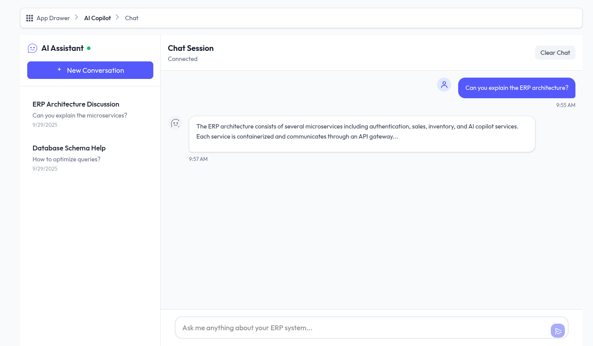
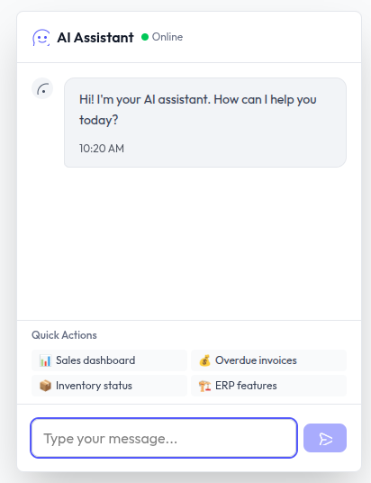

# ERP AI Copilot Service

A sophisticated, enterprise-grade AI copilot service with **step-by-step reasoning**, real-time WebSocket streaming, and comprehensive ERP integration. Features transparent AI decision-making, background job processing, and enterprise security with RBAC.

## 🚀 Core Features

### 🧠 AI Reasoning Engine
- **Step-by-Step Reasoning**: Transparent AI decision-making with numbered steps and icons (🧠📂🌐💻🗂️✅)
- **Real-time Streaming**: WebSocket-based reasoning step streaming via `/api/v1/websocket/ws/reasoning/{conversation_id}`
- **Multi-Model Support**: OpenAI GPT-4, Anthropic Claude, and local Ollama models with context optimization
- **RAG Integration**: Retrieval-Augmented Generation with Qdrant vector search




### 💬 Conversation Management
- **Session-based Loading**: Load conversations by session ID for optimized frontend performance
- **MongoDB Persistence**: Conversation storage with Redis caching for fast access
- **Message History**: Complete CRUD operations for conversations and messages
- **Analytics**: Conversation analytics and search capabilities

### 📚 Knowledge Base Automation
- **File Watcher Service**: Monitors documentation folder for automatic updates
- **Background Processing**: Async job queue for knowledge base refresh and optimization
- **Semantic Search**: Vector-powered search across ERP documentation and architecture
- **Category Management**: Organized knowledge base with category filtering

### 🔐 Enterprise Security
- **API Gateway Integration**: Authenticated access to ERP microservices
- **RBAC System Commands**: Role-based execution of system commands (docker, sudo)
- **JWT Authentication**: Token-based auth with WebSocket support
- **Third-party API Proxy**: Secure external API integration with rate limiting

### ⚡ Performance & Scalability
- **Background Job Processing**: Async task queue with priority handling
- **Redis Caching**: Token validation and conversation caching
- **Connection Management**: Robust WebSocket connection handling
- **Memory Management**: User context optimization and TTL cleanup

## 🌐 WebSocket Endpoints

### Real-time Communication
- **`/api/v1/websocket/ws/reasoning/{conversation_id}`**: Step-by-step reasoning streaming with icons
- **`/api/v1/ws/chat/{conversation_id}`**: Interactive chat sessions with message history

### WebSocket Features
- **Token Authentication**: JWT-based authentication with fallback to gRPC auth service
- **Connection Management**: Robust connection handling with reconnection support
- **Message Processing**: Real-time message processing with reasoning steps
- **Error Handling**: Comprehensive error handling and logging

## 📡 API Endpoints

### 💬 Conversation Management (`/api/v1/conversations/*`)
- `POST /conversations` - Create new conversation session
- `GET /conversations` - List user conversations with pagination
- `GET /conversations/{id}` - Get conversation with optional messages
- `PATCH /conversations/{id}` - Update conversation metadata
- `DELETE /conversations/{id}` - Delete conversation
- `POST /conversations/{id}/archive` - Archive conversation
- `GET /conversations/search` - Search conversations
- `GET /conversations/analytics` - Conversation analytics
- `GET /conversations/{id}/messages` - Get conversation messages

### 🧠 Memory & Context (`/api/v1/memory/*`)
- `POST /memory/store` - Store user memory/context
- `GET /memory/retrieve/{id}` - Retrieve specific memory
- `GET /memory/search` - Search memories by content
- `GET /memory/context/{conversation_id}` - Get conversation context
- `DELETE /memory/delete/{id}` - Delete memory
- `GET /memory/stats` - Memory usage statistics

### 📚 Knowledge Base (`/api/v1/knowledge-base/*`)
- `POST /knowledge-base/initialize` - Initialize knowledge base
- `GET /knowledge-base/status` - Get initialization status
- `POST /knowledge-base/refresh` - Refresh entire knowledge base
- `POST /knowledge-base/add-documentation` - Add new documentation
- `GET /knowledge-base/search` - Semantic search knowledge base
- `GET /knowledge-base/categories` - Get knowledge categories

### ⚙️ Background Jobs (`/api/v1/background-jobs/*`)
- `GET /background-jobs/status` - Job queue status
- `GET /background-jobs/job/{id}` - Specific job status
- `POST /background-jobs/schedule` - Schedule background job
- `DELETE /background-jobs/job/{id}` - Cancel job
- `GET /background-jobs/file-watcher/status` - File watcher status
- `POST /background-jobs/file-watcher/rescan` - Force file rescan
- `POST /background-jobs/knowledge-base/refresh` - Schedule KB refresh
- `POST /background-jobs/optimize-context/{user_id}` - Optimize user context

### 🖥️ System Commands (`/api/v1/system-commands/*`)
- `POST /system-commands/execute` - Execute system command (RBAC)
- `GET /system-commands/permissions` - Get user permissions
- `GET /system-commands/history` - Command execution history
- `POST /system-commands/validate` - Validate command without execution

### 🌐 Third-party APIs (`/api/v1/third-party-apis/*`)
- `POST /third-party-apis/call` - Secure API proxy call
- `GET /third-party-apis/available` - Available APIs for user
- `POST /third-party-apis/configure` - Configure API credentials
- `GET /third-party-apis/usage/{api_name}` - API usage statistics

## 📊 Implementation Status

| Feature Category | Status | Completion |
|------------------|--------|-----------|
| **Step-by-Step Reasoning** | ✅ Complete | 100% |
| **WebSocket Streaming** | ✅ Complete | 100% |
| **Conversation Management** | ✅ Complete | 100% |
| **Memory & Context** | ✅ Complete | 100% |
| **Knowledge Base** | ✅ Complete | 100% |
| **Background Jobs** | ✅ Complete | 100% |
| **File Watcher** | ✅ Complete | 100% |
| **System Commands** | ✅ Complete | 100% |
| **Third-party APIs** | ✅ Complete | 100% |
| **API Gateway Integration** | ✅ Complete | 100% |
| **RBAC Security** | ✅ Complete | 100% |
| **Redis Caching** | ✅ Complete | 100% |
| **Vector Search (Qdrant)** | ✅ Complete | 100% |
| **Multi-tenant Support** | ⚠️ Partial | 80% |
| **Event System** | ⚠️ Partial | 75% |

## 🏗️ System Architecture

```
┌─────────────────┐    WebSocket     ┌──────────────────┐    gRPC/HTTP    ┌─────────────────┐
│   Frontend      │◄─────────────────►│   AI Copilot     │◄───────────────►│  API Gateway    │
│   (React TS)    │    Reasoning      │   (FastAPI)      │   Auth & Data   │   (Go)          │
│                 │    Streaming      │                  │                 │                 │
└─────────────────┘                   └──────────────────┘                 └─────────────────┘
                                              │                                      │
                                              ▼                                      ▼
                                    ┌──────────────────┐                 ┌─────────────────┐
                                    │   Data Layer     │                 │  ERP Services   │
                                    │                  │                 │                 │
                                    │ • MongoDB (Docs) │                 │ • Auth Service  │
                                    │ • Redis (Cache)  │                 │ • Sales Service │
                                    │ • Qdrant (Vector)│                 │ • Invoice Svc   │
                                    │ • Kafka (Events) │                 │ • Inventory Svc │
                                    └──────────────────┘                 └─────────────────┘
```

### 🔄 Data Flow
1. **Frontend** sends chat message via WebSocket
2. **AI Copilot** processes with step-by-step reasoning
3. **Reasoning steps** streamed live to frontend with icons
4. **API Gateway** provides authenticated access to ERP data
5. **Vector Search** retrieves relevant documentation context
6. **Background Jobs** handle heavy operations asynchronously

## 🛠️ Technology Stack

### Backend Services
- **FastAPI**: Python 3.11+ web framework with async support
- **WebSocket**: Real-time reasoning step streaming
- **Background Jobs**: Celery with Redis broker for async processing
- **File Watcher**: Automatic documentation monitoring and updates

### AI & ML Stack
- **LangChain**: AI reasoning framework and prompt management
- **OpenAI GPT-4**: Primary reasoning model
- **Anthropic Claude**: Alternative reasoning model
- **Ollama**: Local model inference support
- **Sentence Transformers**: Text embeddings for vector search

### Data & Storage
- **MongoDB**: Document storage for conversations, memory, knowledge base
- **Redis**: Caching layer for tokens and session data
- **Qdrant**: Vector database for semantic search and RAG
- **PostgreSQL**: ERP transactional data (via API Gateway)

### Integration & Communication
- **Kafka**: Event streaming and microservice communication
- **gRPC**: High-performance service-to-service communication
- **JWT**: Token-based authentication with API Gateway
- **WebSocket**: Real-time bidirectional communication

### Infrastructure & Monitoring
- **Docker & Docker Compose**: Containerization and orchestration
- **Circuit Breakers**: Resilience patterns for service failures
- **Connection Health Monitoring**: Real-time service connectivity diagnostics
- **RBAC**: Role-based access control for security
- **SQLAlchemy**: Database ORM with async support
- **Motor**: Async MongoDB driver
- **Redis**: Token caching and rate limiting
- **Qdrant**: Vector database for RAG system
- **gRPC**: High-performance service communication
- **WebSockets**: Real-time bidirectional communication

### AI/ML
- **OpenAI GPT-4**: Cloud-based language models
- **Anthropic Claude**: Alternative AI provider
- **Ollama**: Local model inference
- **LangChain**: AI application framework
- **Sentence Transformers**: Embedding generation

### Infrastructure
- **Docker**: Containerization
- **Celery**: Background task processing
- **Kafka**: Event streaming
- **Prometheus**: Metrics and monitoring
- **Structlog**: Structured logging

## 🔧 Connection Troubleshooting

### Common Connection Issues

#### Docker API Connection Error
**Error**: `unsupported URL scheme "http+docker"`

**Solution**: The service discovery now includes multiple fallback methods:
1. Environment-based Docker client (`docker.from_env()`)
2. Direct socket connection (`unix:///var/run/docker.sock`)
3. TCP connection for Docker-in-Docker scenarios
4. Static service registration fallback

#### API Gateway Hostname Resolution
**Error**: `Name or service not known: api-gateway`

**Solution**: 
- Ensure all services are on the `erp-network` Docker network
- Use container names for internal communication (`api-gateway:8000`)
- Added DNS caching and connection resilience

### Testing Connections

```bash
# Test all connections
./test-ai-copilot-connections.sh

# Test specific components
./test-ai-copilot-connections.sh network
./test-ai-copilot-connections.sh api-gateway
./test-ai-copilot-connections.sh discovery

# Test from within AI Copilot container
docker exec erp-suite-ai-copilot python scripts/test_connections.py
```

### Health Check Endpoints

```bash
# Basic health check
curl http://localhost:8003/health

# Detailed health with connection diagnostics
curl http://localhost:8003/health/detailed

# Connection-specific diagnostics
curl http://localhost:8003/health/connections
```

### Docker Compose Configuration

The `docker-compose.override.yml` file includes:
- Proper network configuration
- Docker socket mounting for service discovery
- Correct hostname resolution settings
- Connection timeout and retry configurations

## 📋 Prerequisites

- Python 3.11+
- Docker and Docker Compose
- PostgreSQL 15+
- Redis 7+
- MongoDB 6+
- Qdrant 1.7+
- Kafka 7.4+

## 🚀 Quick Start

### 1. Clone the Repository
```bash
git clone <repository-url>
cd erp-ai-copilot
```

### 2. Set Environment Variables
```bash
cp .env.example .env
# Edit .env with your configuration
```

### 3. Start Infrastructure
```bash
# Start the required infrastructure services
docker-compose -f ../erp-suite-infrastructure/docker-compose.yml up -d postgres redis mongodb qdrant kafka

# Verify Redis is running (for token caching)
redis-cli ping
```

### 4. Initialize Databases
```bash
# Initialize PostgreSQL
psql -h localhost -U postgres -f scripts/init-ai-copilot-db.sql

# Initialize MongoDB
mongo --host localhost:27017 --username root --password password scripts/init-mongodb.js
```

### 5. Install Dependencies
```bash
pip install -r requirements.txt
```

### 6. Run the Service
```bash
# Development mode
uvicorn app.main:app --reload --host 0.0.0.0 --port 8080

# Production mode
python -m app.main
```

### 7. Start Background Workers
```bash
# Start Celery worker
celery -A app.core.celery_app worker --loglevel=info

# Start Celery beat (scheduler)
celery -A app.core.celery_app beat --loglevel=info
```

## 🌟 WebSocket Real-time Features

### 🔄 Step-by-Step Reasoning Streaming
**Endpoint**: `/api/v1/websocket/ws/reasoning/{conversation_id}`

**Features**:
- **Live Reasoning Steps**: Real-time streaming of AI reasoning process with numbered steps
- **Visual Icons**: Each step type has distinctive icons (🧠📂🌐💻🗂️✅)
- **Progress Tracking**: Frontend can track reasoning progress in real-time
- **Error Handling**: Graceful error handling with detailed error messages

**Step Types**:
- 🧠 **Thinking**: AI analysis and decision-making
- 📂 **Data Retrieval**: Fetching information from databases/APIs
- 🌐 **API Calls**: External service integration
- 💻 **Processing**: Data processing and computation
- 🗂️ **Knowledge Search**: Vector search and RAG operations
- ✅ **Completion**: Final results and conclusions

### 💬 Interactive Chat Sessions
**Endpoint**: `/api/v1/ws/chat/{conversation_id}`

**Features**:
- **Real-time Messaging**: Bidirectional communication with instant responses
- **Session Management**: Persistent conversation sessions with message history
- **Context Awareness**: Maintains conversation context across messages
- **Multi-user Support**: Concurrent chat sessions with proper isolation

### 🔐 WebSocket Authentication
- **JWT Token Authentication**: Secure token-based authentication
- **gRPC Fallback**: Automatic fallback to gRPC auth service
- **Redis Token Caching**: 30-minute TTL for performance optimization
- **Connection Validation**: Continuous token validation during sessions

### 📊 Connection Management
- **Robust Reconnection**: Automatic reconnection with exponential backoff
- **Health Monitoring**: Real-time connection health tracking
- **Error Recovery**: Graceful error handling and recovery mechanisms
- **Metrics Integration**: Prometheus metrics for monitoring WebSocket performance

## 📚 API Usage Examples

### 🧠 Step-by-Step Reasoning Example

**WebSocket Connection**:
```javascript
const ws = new WebSocket(`ws://localhost:8080/api/v1/websocket/ws/reasoning/${conversationId}?token=${jwtToken}`);

ws.onmessage = (event) => {
    const step = JSON.parse(event.data);
    console.log(`${step.icon} Step ${step.step_number}: ${step.description}`);
    // Update UI with reasoning step
};
```

**Expected Response Stream**:
```json
{"step_number": 1, "icon": "🧠", "description": "Analyzing user query for intent", "status": "processing"}
{"step_number": 2, "icon": "📂", "description": "Retrieving customer data from ERP", "status": "processing"}
{"step_number": 3, "icon": "🌐", "description": "Calling external API for validation", "status": "processing"}
{"step_number": 4, "icon": "✅", "description": "Analysis complete", "status": "completed", "result": {...}}
```

### 💬 Conversation Management Examples

**Create New Conversation**:
```bash
curl -X POST "http://localhost:8080/api/v1/conversations" \
  -H "Authorization: Bearer ${JWT_TOKEN}" \
  -H "Content-Type: application/json" \
  -d '{
    "title": "Customer Support Query",
    "context": {"department": "sales", "priority": "high"}
  }'
```

**Send Chat Message**:
```bash
curl -X POST "http://localhost:8080/api/v1/chat/message" \
  -H "Authorization: Bearer ${JWT_TOKEN}" \
  -H "Content-Type: application/json" \
  -d '{
    "conversation_id": "conv_123",
    "message": "Show me sales report for Q3 2024",
    "enable_reasoning": true
  }'
```

### 📚 Knowledge Base Examples

**Search Knowledge Base**:
```bash
curl -X GET "http://localhost:8080/api/v1/knowledge-base/search?query=invoice%20processing&limit=5" \
  -H "Authorization: Bearer ${JWT_TOKEN}"
```

**Initialize Knowledge Base**:
```bash
curl -X POST "http://localhost:8080/api/v1/knowledge-base/initialize?force_refresh=true" \
  -H "Authorization: Bearer ${JWT_TOKEN}"
```

### 🖥️ System Commands Examples

**Execute Docker Command** (Admin only):
```bash
curl -X POST "http://localhost:8080/api/v1/system-commands/execute" \
  -H "Authorization: Bearer ${ADMIN_JWT_TOKEN}" \
  -H "Content-Type: application/json" \
  -d '{
    "command": "docker ps",
    "working_directory": "/app",
    "timeout": 30
  }'
```

**Validate Command**:
```bash
curl -X POST "http://localhost:8080/api/v1/system-commands/validate" \
  -H "Authorization: Bearer ${JWT_TOKEN}" \
  -H "Content-Type: application/json" \
  -d '{"command": "sudo systemctl status nginx"}'
```

### 🌐 Third-party API Examples

**Call External API**:
```bash
curl -X POST "http://localhost:8080/api/v1/third-party-apis/call" \
  -H "Authorization: Bearer ${JWT_TOKEN}" \
  -H "Content-Type: application/json" \
  -d '{
    "api_name": "stripe",
    "endpoint": "/v1/customers",
    "method": "GET",
    "headers": {"Stripe-Version": "2023-10-16"}
  }'
```

## 📖 Documentation

### Developer Resources
- **[Interactive API Docs](http://localhost:8080/docs)** - Swagger UI with live testing
- **[ReDoc Documentation](http://localhost:8080/redoc)** - Alternative API documentation
- **[OpenAPI Spec](http://localhost:8080/openapi.json)** - Machine-readable API specification

### Testing
```bash
# Run all tests
pytest

# Test WebSocket functionality
pytest tests/test_websocket.py -v

# Test reasoning engine
pytest tests/test_reasoning.py -v

# Run with coverage
pytest --cov=app tests/
```

### Code Quality
```bash
# Format code
black app/

# Lint code
flake8 app/

# Type checking
mypy app/
```

## 🔧 Configuration

### Environment Variables

#### Database Configuration
```bash
DB_HOST=localhost
DB_PORT=5432
DB_NAME=erp_ai_copilot
DB_USER=postgres
DB_PASSWORD=postgres
```

#### Redis Configuration
```bash
REDIS_HOST=localhost
REDIS_PORT=6379
REDIS_PASSWORD=redispassword
REDIS_DB=2
```

#### AI Model Configuration
```bash
OPENAI_API_KEY=your-openai-api-key
ANTHROPIC_API_KEY=your-anthropic-api-key
OLLAMA_BASE_URL=http://localhost:11434
```

#### Security Configuration
```bash
JWT_SECRET=your-super-secret-jwt-key
CORS_ORIGINS=http://localhost:3000,http://localhost:8080
```

### Service Configuration
```bash
SERVICE_NAME=ai-copilot
SERVICE_VERSION=1.0.0
ENVIRONMENT=development
```

## 🧪 Testing

### Test Structure
```
tests/
├── unit/
│   ├── test_agents/
│   ├── test_tools/
│   └── test_services/
├── integration/
│   ├── test_api/
│   └── test_database/
└── fixtures/
```

### Running Tests
```bash
# All tests
pytest

# With coverage
pytest --cov=app tests/

# Specific test file
pytest tests/test_rag_tools.py -v

# Integration tests only
pytest tests/integration/ -v
```

## 🐳 Docker Support

### Development
```bash
# Build development image
docker build -t ai-copilot:dev .

# Run with docker-compose
docker-compose -f docker-compose.dev.yml up
```

### Production
```bash
# Build production image
docker build -t ai-copilot:latest .

# Run production stack
docker-compose -f docker-compose.yml up -d
```

## 🚀 Deployment

### Environment Setup
1. **Development**: Local development with hot reload
2. **Staging**: Feature branch testing environment
3. **Production**: Scalable production deployment

### Scaling Considerations
- **Horizontal scaling**: Multiple service instances
- **Database scaling**: Read replicas and sharding
- **Caching**: Redis cluster for high availability
- **Message queue**: Kafka cluster for event processing

## 📊 Monitoring

### Metrics
- **Application metrics**: Prometheus + Grafana
- **Business metrics**: Custom dashboards
- **Performance metrics**: Response times, throughput
- **Error tracking**: Sentry integration

### Health Checks
```bash
# Service health
curl http://localhost:8080/health

# Detailed status
curl http://localhost:8080/health/detailed

# WebSocket health
curl http://localhost:8080/api/v1/websocket/health

# Background jobs status
curl http://localhost:8080/api/v1/background-jobs/status
```

## 🎯 Integration with ERP Suite

### API Gateway Integration
The AI Copilot integrates with the ERP Suite through the API Gateway:

```bash
# Authenticate via API Gateway
curl -X POST "http://localhost:8000/api/v1/auth/login" \
  -H "Content-Type: application/json" \
  -d '{"username": "admin", "password": "admin123"}'

# Use token for AI Copilot requests
curl -X POST "http://localhost:8080/api/v1/chat/message" \
  -H "Authorization: Bearer ${API_GATEWAY_TOKEN}" \
  -H "Content-Type: application/json" \
  -d '{"message": "Show me customer analytics", "conversation_id": "conv_123"}'
```

### Service Discovery
The AI Copilot automatically discovers available ERP services:
- **Auth Service**: User authentication and RBAC
- **Sales Service**: Customer and sales data
- **Invoice Service**: Billing and invoice management
- **Inventory Service**: Product and stock management
- **Subscription Service**: SaaS billing and features

### Data Access Patterns
1. **Authentication**: JWT tokens validated via API Gateway
2. **Data Retrieval**: Authenticated requests to ERP services
3. **Real-time Updates**: WebSocket notifications for data changes
4. **Background Processing**: Async jobs for heavy data operations

---

## 🚀 Getting Started Checklist

- [ ] **Infrastructure**: Start PostgreSQL, Redis, MongoDB, Qdrant, Kafka
- [ ] **Environment**: Configure `.env` file with API keys and database connections
- [ ] **Dependencies**: Install Python requirements and initialize databases
- [ ] **Services**: Start AI Copilot service and background workers
- [ ] **Testing**: Verify WebSocket connections and API endpoints
- [ ] **Integration**: Test authentication with API Gateway
- [ ] **Knowledge Base**: Initialize with ERP documentation
- [ ] **Monitoring**: Set up Prometheus and Grafana dashboards

**🎉 Ready to use the ERP AI Copilot with step-by-step reasoning and real-time WebSocket streaming!**
```

## 🤝 Contributing

### Development Workflow
1. Fork the repository
2. Create feature branch: `git checkout -b feature/amazing-feature`
3. Commit changes: `git commit -m 'Add amazing feature'`
4. Push to branch: `git push origin feature/amazing-feature`
5. Open pull request

### Code Standards
- Follow PEP 8 style guidelines
- Write comprehensive tests
- Update documentation
- Use conventional commits

### Branch Strategy
- `main`: Production-ready code
- `develop`: Integration branch
- `feature/*`: New features
- `hotfix/*`: Critical fixes

## 🔐 Security

### Authentication & Security
- **Token Validation**: JWT-based authentication with gRPC fallback
- **Token Caching**: Redis-based caching with 30-minute TTL
- **WebSocket Security**: Robust connection management with proper authentication flow
- **Rate Limiting**: Built-in protection against abuse
- **Role-based Access Control**: Fine-grained permissions system (RBAC)

### Data Protection
- Encryption at rest and in transit
- PII data masking
- Audit logging for all actions
- GDPR compliance features

## 📞 Support

### Getting Help
- **Documentation**: Check the [Developer Guide](DEVELOPER_DOCUMENTATION.md)
- **Issues**: Create GitHub issues for bugs or feature requests
- **Discussions**: Use GitHub discussions for questions
- **Slack**: Join our community channel

### Troubleshooting

#### Common Issues
1. **Database connection issues**: Check environment variables
2. **AI model errors**: Verify API keys and quotas
3. **Memory issues**: Increase Docker memory limits
4. **Port conflicts**: Check for conflicting services

#### Debug Mode
```bash
# Enable debug logging
export DEBUG=true

# Verbose API logs
export LOG_LEVEL=DEBUG
```

## 📄 License

This project is licensed under the MIT License - see the [LICENSE](LICENSE) file for details.

## 🙏 Acknowledgments

- Built with [FastAPI](https://fastapi.tiangolo.com/)
- AI models from [OpenAI](https://openai.com/) and [Anthropic](https://anthropic.com/)
- Vector search powered by [Qdrant](https://qdrant.tech/)
- Database management with [SQLAlchemy](https://www.sqlalchemy.org/)

---

**Built with ❤️ by the UNIBASE ERP Team**

